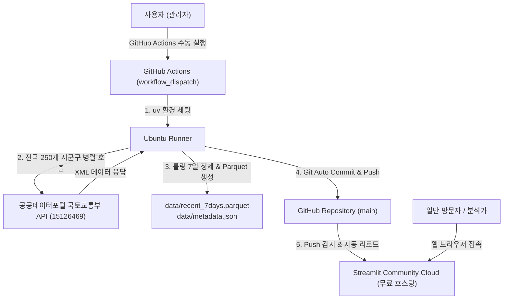

# Architecture Design: 전국 아파트 매매 실거래가 롤링 7일 대시보드

- **작성일**: 2026-09-30
- **상태**: 승인 대기 (Approved by User in Brainstorming)
- **작성자**: Antigravity & User

---

## 1. 개요 및 목적 (Summary & Goals)

### 1.1 개요
공공데이터포털(data.go.kr)의 '국토교통부 아파트 매매 실거래가 자료 OpenAPI(15126469)'를 활용하여, 전국 단위의 최근 7일(롤링) 아파트 실거래가 데이터를 수집하고 이를 분석 및 시각화하는 Streamlit 대시보드를 구축합니다.

### 1.2 목표 (Goals)
1. **롤링 7일 데이터 파이프라인**:
   - 실행일(Today) 기준 최근 7일간의 전국 실거래가를 고속 멀티스레딩으로 수집
   - 월경계(월초) 시 당월/전월 자동 병합 및 7일 필터링
   - 정제된 단일 압축 파일(`data/recent_7days.parquet`, ~1MB) 및 메타정보(`data/metadata.json`) 덮어쓰기 저장
2. **GitHub Actions 수동 배치 자동화**:
   - `workflow_dispatch`를 통해 버튼 클릭 시 자동으로 데이터를 수집하고 최신 Parquet를 저장소에 자동 커밋 & 푸시
   - API 키 보안을 위해 GitHub Secrets(`DATA_GO_KR_API_KEY`) 활용
   - 추후 필요 시 매일 정기 실행(cron)으로 즉시 전환 가능한 구조 지원
3. **Streamlit 웹 대시보드**:
   - 100% 무료 호스팅(Streamlit Community Cloud)에 최적화된 고속 로딩
   - 사이드바 다차원 계층 필터 (시도 $\rightarrow$ 시군구, 전용면적, 가격대, 단지명 검색)
   - 상단 핵심 4대 KPI 메트릭 (총 거래량, 평균 거래가, 최고가 단지, 평당 평균가)
   - 4개 분석 탭 (거래 트렌드 & 가격분포 / 최고가 TOP 랭킹 / 지역별 인터랙티브 지도 / 상세 거래내역 및 CSV 다운로드)
4. **표준 개발 환경 준수**:
   - Python 3.11+, 패키지 및 가상환경 관리는 반드시 `uv` 활용
   - 모든 상대경로 기반 파일 I/O 및 모듈화

### 1.3 비목표 (Non-goals)
- 과거 수년간의 방대한 빅데이터 누적 (본 프로젝트는 '최근 7일 롤링'에 집중)
- 유료 클라우드 DB(AWS RDS, GCP BigQuery 등) 사용 지양 (완전 무료 아키텍처)
- 아파트 전월세, 분양권, 오피스텔 등 기타 부동산 유형 수집 (아파트 '매매' 실거래에 한정)

---

## 2. 시스템 아키텍처 (System Architecture)



---

## 3. 데이터 파이프라인 및 스키마 (Data Pipeline & Schema)

### 3.1 시군구 코드 관리 (`data/lawd_cd.json`)
* 국토교통부 API는 5자리 시군구 법정동 코드(`LAWD_CD`) 단위로만 조회가 가능합니다.
* 전국 17개 시도 산하 약 250개 시군구 코드 매핑 테이블을 로컬 JSON으로 보관하여 불필요한 네트워크 오버헤드를 차단합니다.

### 3.2 롤링 7일 날짜 및 월경계(Boundary) 계산 로직
1. 기준 종료일: `today` (스크립트 실행일)
2. 기준 시작일: `today - 6일` (총 7일 범위)
3. API 호출 연월(`DEAL_YMD`):
   - 시작일과 종료일의 연월(`YYYYMM`)이 동일한 경우: 1개 연월만 조회
   - 월초로 인해 시작일과 종료일의 연월이 다른 경우: 전월 + 당월 2개 연월을 각각 조회 후 병합
4. 계약일자 필터링: 각 레코드의 `dealYear`, `dealMonth`, `dealDay`를 조합하여 `deal_date`를 산출하고, `[기준 시작일, 기준 종료일]` 범위에 해당하는 건만 필터링

### 3.3 정제 데이터 스키마 (`recent_7days.parquet`)
| 필드명 | 타입 | 설명 및 변환 규칙 |
| :--- | :--- | :--- |
| `deal_date` | `date` | 계약일자 (`YYYY-MM-DD`) |
| `sido` | `str` | 시/도 명칭 (예: `서울특별시`) |
| `sigungu` | `str` | 시/군/구 명칭 (예: `강남구`) |
| `dong` | `str` | 법정동 명칭 (예: `개포동`) |
| `apt_name` | `str` | 아파트 단지명 (예: `개포자이프레지던스`) |
| `area` | `float` | 전용면적 ㎡ (예: `84.97`) |
| `pyeong` | `float` | 전용 평형 환산 (`area / 3.305785`, 소수점 1자리) |
| `floor` | `int` | 층수 (예: `15`) |
| `build_year` | `int` | 건축년도 (예: `2023`) |
| `price_manwon` | `int` | 거래금액 만원 단위 (공백 및 콤마 제거 정수화, 예: `285000`) |
| `price_eok` | `float` | 거래금액 억원 단위 표기 (`price_manwon / 10000`, 예: `28.5`) |
| `price_per_py` | `float` | 평당 가격 (`price_manwon / pyeong`, 만원/평) |
| `deal_type` | `str` | 중개거래 / 직거래 구분 |

### 3.4 메타데이터 (`data/metadata.json`)
```json
{
  "last_updated_at": "2026-09-30 14:00:00 KST",
  "start_date": "2026-09-24",
  "end_date": "2026-09-30",
  "total_deals": 8421,
  "sigungu_count": 250,
  "success_sigungu": 250
}
```

---

## 4. GitHub Actions 자동화 워크플로우

- **파일 위치**: `.github/workflows/daily_collect.yml`
- **트리거**:
  - `workflow_dispatch`: GitHub 웹 UI에서 [Run workflow] 버튼으로 즉시 실행
  - *(옵션 주석 포함)*: `schedule: - cron: '0 21 * * *'` (매일 한국시간 06:00 정기 자동 실행용)
- **보안**: GitHub Secrets에 저장된 `DATA_GO_KR_API_KEY` 환경변수 전달
- **패키지 관리**: `astral-sh/setup-uv`를 통한 초고속 환경 세팅
- **자동 커밋**:
  - 수집 실행 후 `data/` 디렉터리에 변경이 감지되면 자동 커밋 & 푸시
  - 커밋 메시지에 `[skip ci]` 포함하여 무한 트리거 방지

---

## 5. Streamlit 대시보드 UI/UX 사양

- **페이지 구성**: Wide Layout (`st.set_page_config(layout="wide", page_title="전국 아파트 실거래가")`)
- **상단 헤더**: 제목 및 메타데이터(데이터 기준 기간, 갱신 일시) 배지
- **사이드바 다차원 필터**:
  1. 시도 선택 (전국 / 17개 시도) $\rightarrow$ 시군구 멀티 선택 드롭다운
  2. 전용면적(평형대) 필터: 전체, 소형(~40㎡), 중소형(40~59㎡), 국민평형(59~84㎡), 대형(84㎡ 초과)
  3. 거래금액(억원) 범위 슬라이더
  4. 단지명 텍스트 검색 입력창
- **상단 메트릭 요약 카드 (4개 KPI)**:
  - 총 거래 건수
  - 평균 거래금액
  - 최고 거래가 단지 및 금액
  - 평당 평균 가격
- **메인 4개 분석 탭**:
  1. **탭 1: 거래 트렌드 & 가격분포**:
     - 일자별 거래량 추이 바 차트 (`plotly.express`)
     - 거래금액대별 분포 히스토그램
     - 평형대별 거래 비중 도넛 차트
  2. **탭 2: 최고가 TOP 랭킹**:
     - 최근 7일 최고가 상위 10개 / 20개 단지 랭킹 리스트 및 카드
     - 단지명, 금액(억), 전용면적, 층, 거래일자 표기
  3. **탭 3: 지역 지도 시각화 (Map)**:
     - 시군구별 평균 실거래가 및 거래량 버블/마커 시각화 (`pydeck`)
     - 전국적 핫스팟 지역 즉시 식별
  4. **탭 4: 상세 내역 조회**:
     - 필터링된 전체 실거래 정렬 테이블
     - CSV 다운로드 버튼 제공

---

## 6. 프로젝트 디렉터리 레이아웃

```text
apt_real_price/
├── .agents/                        # 워크스페이스 스킬 및 지침
│   └── skills/
├── .github/
│   └── workflows/
│       └── daily_collect.yml       # GitHub Actions 수동 수집 워크플로우
├── data/
│   ├── lawd_cd.json                # 전국 시군구 법정동 코드
│   ├── recent_7days.parquet        # 최근 7일 롤링 실거래가 데이터
│   └── metadata.json               # 수집 메타데이터
├── src/
│   ├── __init__.py
│   ├── config.py                   # 경로 및 환경변수 설정
│   ├── collector.py                # 국토부 API 병렬 수집 모듈
│   ├── processor.py                # 7일 롤링 필터 및 데이터 정제 모듈
│   └── utils.py                    # 법정동 코드 로더 및 헬퍼 함수
├── tests/
│   ├── __init__.py
│   ├── test_processor.py           # 데이터 정제 및 날짜 필터링 유닛 테스트
│   └── test_collector.py           # 수집기 파싱 및 에러 핸들링 테스트 (Mock 활용)
├── app.py                          # Streamlit 메인 대시보드
├── pyproject.toml                  # uv 기반 프로젝트 의존성 관리
├── .env.example                    # 로컬 환경변수 템플릿
├── .gitignore                      # .venv, 캐시 등 제외
└── README.md                       # 프로젝트 소개 및 실행/배포 가이드
```

---

## 7. 검증 및 테스트 계획 (Verification Plan)

1. **단위 테스트 (Unit Tests)**:
   - `tests/test_processor.py`:
     - 금액 문자열(`"   15,000 "`) $\rightarrow$ 정수(`15000`) 및 억원(`1.5`) 변환 검증
     - 롤링 7일 기준 날짜 필터링 정확도 (범위 내/외 경계값 테스트)
     - 평형 환산 및 평당 가격 계산식 검증
   - `tests/test_collector.py`:
     - 국토부 XML 응답 파싱 정확도 검증 (Mock XML 데이터 활용)
     - 타임아웃 및 재시도 메커니즘 동작 검증
2. **통합 테스트 (Integration / E2E)**:
   - 실제 API 키를 통한 시군구 1~2개 샘플 수집 테스트
   - `data/recent_7days.parquet` 생성 및 schema 검증
   - `streamlit run app.py` 무결점 로컬 구동 및 필터링 동작 확인
3. **CI 워크플로우 검증**:
   - `pytest`를 통한 테스트 자동화
   - GitHub Actions `workflow_dispatch` 수동 트리거 테스트
